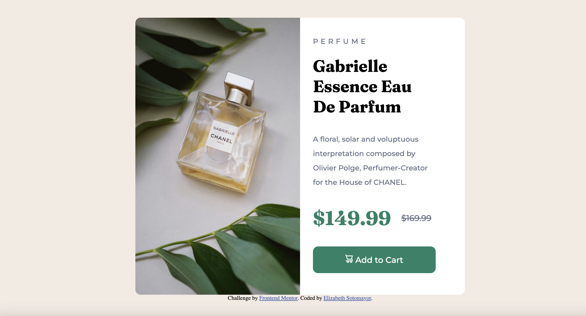

# Frontend Mentor - Product preview card component solution

This is a solution to the [Product preview card component challenge on Frontend Mentor](https://www.frontendmentor.io/challenges/product-preview-card-component-GO7UmttRfa). Frontend Mentor challenges help you improve your coding skills by building realistic projects.

## Table of contents

- [Overview](#overview)
  - [The challenge](#the-challenge)
  - [Screenshot](#screenshot)
  - [Links](#links)
- [My process](#my-process)
  - [Built with](#built-with)
  - [What I learned](#what-i-learned)
  - [Continued development](#continued-development)
  - [Useful resources](#useful-resources)
- [Author](#author)
- [Acknowledgments](#acknowledgments)

## Overview

### The challenge

Users should be able to:

- View the optimal layout depending on their device's screen size
- See hover and focus states for interactive elements

### Screenshot

### Links

- Solution URL: 
- Live Site URL: 

## My process

### Built with

- Semantic HTML5 markup
- CSS custom properties
- Flexbox
- Mobile-first workflow

### What I learned

Using divs as flex containers, border-radius property and how to selectively style corners of images, text-decoration property to achieve strike-through effect.

### Continued development

More experience with using calc(rem/16) in CSS styling for font sizes. Using flexbox in a way that produces desired results in less time.

## Author

- Website - [Elizabeth Sotomayor](https://elizabethrsotomayor.github.io/somyo2/)
- Frontend Mentor - [@elizabethrsotomayor](https://www.frontendmentor.io/profile/elizabethrsotomayor)
- Twitter - [@lahijadelmar\_](https://www.twitter.com/lahijadelmar_)
